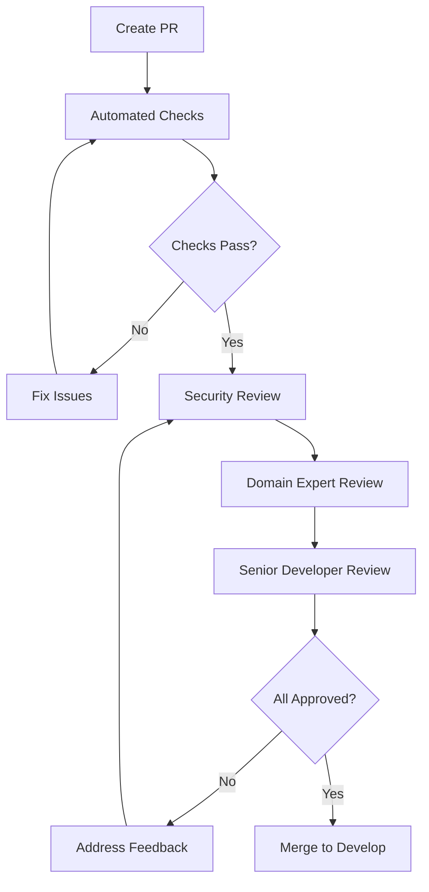
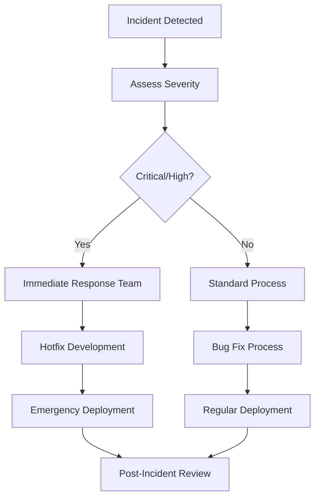

# Development Workflow - Bank Client

This document outlines the development workflow, git strategy, and processes for the Bank Client frontend application.

## 📋 Table of Contents

- [Git Workflow Strategy](#git-workflow-strategy)
- [Branch Management](#branch-management)
- [Development Process](#development-process)
- [Code Review Process](#code-review-process)
- [Testing Workflow](#testing-workflow)
- [Deployment Pipeline](#deployment-pipeline)
- [Banking-Specific Workflows](#banking-specific-workflows)
- [Quality Assurance](#quality-assurance)
- [Release Management](#release-management)

## 🌳 Git Workflow Strategy

We follow a **Git Flow** strategy adapted for banking software development with additional security and compliance considerations.

### Branch Types

```
master (production)
├── develop (integration)
├── feature/* (new features)
├── bugfix/* (bug fixes)
├── hotfix/* (critical fixes)
├── release/* (release preparation)
└── security/* (security patches)
```

### Branch Naming Convention

```bash
# Feature branches
feature/JIRA-123-payment-authorization
feature/456-multi-currency-support

# Bug fix branches
bugfix/JIRA-789-currency-conversion-error
bugfix/101-authentication-timeout

# Hotfix branches
hotfix/JIRA-999-security-vulnerability
hotfix/202-critical-payment-bug

# Release branches
release/v2.1.0
release/v2.1.1-hotfix

# Security branches
security/JIRA-SEC-001-xss-prevention
security/jwt-token-validation
```

## 🔄 Branch Management

### Master Branch

- **Purpose**: Production-ready code
- **Protection**: Requires PR approval and passing CI
- **Deployment**: Automatically deploys to production
- **Access**: Only maintainers can merge

### Develop Branch

- **Purpose**: Integration branch for features
- **Testing**: Continuous integration and automated testing
- **Deployment**: Automatically deploys to staging
- **Merging**: Features merge here first

### Feature Branches

```bash
# Create feature branch
git checkout develop
git pull origin develop
git checkout -b feature/JIRA-123-payment-authorization

# Work on feature
git add .
git commit -m "feat(payment): implement authorization flow"

# Push and create PR
git push origin feature/JIRA-123-payment-authorization
```

### Hotfix Workflow

```bash
# Create hotfix from master
git checkout master
git pull origin master
git checkout -b hotfix/JIRA-999-security-vulnerability

# Fix the issue
git add .
git commit -m "fix(security): resolve XSS vulnerability"

# Merge to both master and develop
git checkout master
git merge hotfix/JIRA-999-security-vulnerability
git checkout develop
git merge hotfix/JIRA-999-security-vulnerability
```

## 🚀 Development Process

### 1. Planning Phase

#### Requirements Analysis
- **Business requirements** documented
- **Security requirements** identified
- **Compliance needs** assessed
- **Technical specifications** defined

#### Task Breakdown
```markdown
Epic: Payment Authorization System
├── Story: JWT Token Validation
├── Story: Authorization Key Generation
├── Story: Email Notification System
└── Story: Transaction Confirmation Flow
```

### 2. Development Phase

#### Environment Setup
```bash
# Clone repository
git clone https://github.com/akkp-windsurf/bank-client.git
cd bank-client

# Install dependencies
yarn install

# Configure environment
cp .env.example .env
nano .env

# Start development server
yarn start
```

#### Development Standards
- **Code quality**: ESLint + Prettier
- **Testing**: 98% coverage requirement
- **Security**: Security-first development
- **Documentation**: Inline and external docs

#### Daily Workflow
```bash
# Start of day
git checkout develop
git pull origin develop
git checkout feature/your-branch
git rebase develop

# During development
yarn test:watch  # Run tests continuously
yarn lint        # Check code quality
yarn start       # Development server

# End of day
git add .
git commit -m "feat: implement payment validation"
git push origin feature/your-branch
```

### 3. Testing Phase

#### Test Types
1. **Unit Tests** - Individual components
2. **Integration Tests** - Component interactions
3. **E2E Tests** - Full user workflows
4. **Security Tests** - Vulnerability scanning
5. **Performance Tests** - Load and stress testing

#### Banking-Specific Testing
```javascript
// Financial calculation tests
describe('Currency Conversion', () => {
  it('should maintain precision in calculations', () => {
    const result = convertCurrency(100.50, 1.2345);
    expect(result).toBe('124.07');
  });
});

// Security tests
describe('Authentication', () => {
  it('should reject expired tokens', () => {
    const expiredToken = generateExpiredToken();
    expect(isTokenValid(expiredToken)).toBe(false);
  });
});
```

## 👥 Code Review Process

### Review Requirements

#### Mandatory Reviews
- **Security review** for all changes
- **Banking domain expert** for financial logic
- **Senior developer** for architecture changes
- **QA engineer** for testing strategy

#### Review Checklist

##### General Code Quality
- [ ] Code follows ESLint rules
- [ ] Proper error handling
- [ ] No hardcoded values
- [ ] Performance considerations
- [ ] Documentation updated

##### Banking-Specific
- [ ] Financial calculations use Decimal.js
- [ ] Input validation implemented
- [ ] Security measures in place
- [ ] Compliance requirements met
- [ ] Audit logging added

##### Testing
- [ ] Unit tests added/updated
- [ ] Integration tests cover new flows
- [ ] Edge cases tested
- [ ] Security scenarios tested
- [ ] Performance impact assessed

### Review Process



### Review Timeline
- **Initial review**: Within 24 hours
- **Security review**: Within 12 hours
- **Follow-up reviews**: Within 8 hours
- **Final approval**: Within 48 hours total

## 🧪 Testing Workflow

### Test-Driven Development (TDD)

```javascript
// 1. Write failing test
describe('PaymentValidator', () => {
  it('should validate payment amount', () => {
    const validator = new PaymentValidator();
    expect(validator.validateAmount(100.50)).toBe(true);
  });
});

// 2. Implement minimum code to pass
class PaymentValidator {
  validateAmount(amount) {
    return amount > 0;
  }
}

// 3. Refactor and improve
class PaymentValidator {
  validateAmount(amount) {
    const decimal = new Decimal(amount);
    return decimal.gt(0) && decimal.lte(1000000);
  }
}
```

### Continuous Testing

```bash
# Run tests continuously during development
yarn test:watch

# Run full test suite before commits
yarn test:coverage

# Run specific test suites
yarn test:unit
yarn test:integration
yarn test:e2e
```

### Banking Test Scenarios

#### Financial Accuracy Tests
```javascript
describe('Financial Calculations', () => {
  test('currency conversion precision', () => {
    const amount = new Decimal('100.50');
    const rate = new Decimal('1.2345');
    const result = amount.mul(rate);
    expect(result.toFixed(2)).toBe('124.07');
  });
});
```

#### Security Tests
```javascript
describe('Security Measures', () => {
  test('input sanitization', () => {
    const maliciousInput = '<script>alert("xss")</script>';
    const sanitized = sanitizeInput(maliciousInput);
    expect(sanitized).not.toContain('<script>');
  });
});
```

## 🚀 Deployment Pipeline

### Environments

#### Development
- **Purpose**: Local development and testing
- **Deployment**: Manual (`yarn start`)
- **Database**: Local PostgreSQL
- **API**: Local backend server

#### Staging
- **Purpose**: Integration testing and QA
- **Deployment**: Automatic on develop branch merge
- **Database**: Staging database with test data
- **API**: Staging backend environment

#### Production
- **Purpose**: Live banking application
- **Deployment**: Manual approval required
- **Database**: Production database
- **API**: Production backend with monitoring

### CI/CD Pipeline

```yaml
# .github/workflows/ci.yml
name: CI/CD Pipeline

on:
  push:
    branches: [develop, master]
  pull_request:
    branches: [develop, master]

jobs:
  test:
    runs-on: ubuntu-latest
    steps:
      - uses: actions/checkout@v2
      - name: Setup Node.js
        uses: actions/setup-node@v2
        with:
          node-version: '16'
      - name: Install dependencies
        run: yarn install
      - name: Run tests
        run: yarn test:coverage
      - name: Security scan
        run: yarn audit
      - name: Build application
        run: yarn build
```

### Deployment Checklist

#### Pre-deployment
- [ ] All tests passing
- [ ] Security scan completed
- [ ] Performance benchmarks met
- [ ] Documentation updated
- [ ] Database migrations ready
- [ ] Rollback plan prepared

#### Post-deployment
- [ ] Health checks passing
- [ ] Monitoring alerts configured
- [ ] Performance metrics normal
- [ ] User acceptance testing
- [ ] Rollback tested

## 🏦 Banking-Specific Workflows

### Financial Feature Development

#### Requirements Phase
1. **Regulatory compliance** review
2. **Security impact** assessment
3. **Audit trail** requirements
4. **Data protection** considerations

#### Implementation Phase
```javascript
// Example: Transaction processing workflow
const processTransaction = async (transactionData) => {
  // 1. Validate input
  const validation = validateTransactionData(transactionData);
  if (!validation.isValid) {
    throw new ValidationError(validation.errors);
  }

  // 2. Security checks
  await performSecurityChecks(transactionData);

  // 3. Business logic
  const result = await executeTransaction(transactionData);

  // 4. Audit logging
  await logTransactionEvent(result);

  return result;
};
```

### Security Workflow

#### Security Review Process
1. **Threat modeling** for new features
2. **Code security** analysis
3. **Dependency vulnerability** scanning
4. **Penetration testing** coordination

#### Security Testing
```javascript
// Security test examples
describe('Security Tests', () => {
  test('prevents SQL injection', () => {
    const maliciousInput = "'; DROP TABLE users; --";
    expect(() => validateInput(maliciousInput)).toThrow();
  });

  test('enforces rate limiting', async () => {
    const requests = Array(100).fill().map(() => makeApiCall());
    const results = await Promise.allSettled(requests);
    const rateLimited = results.filter(r => r.status === 'rejected');
    expect(rateLimited.length).toBeGreaterThan(0);
  });
});
```

### Compliance Workflow

#### GDPR Compliance
- **Data mapping** for personal information
- **Consent management** implementation
- **Data retention** policy enforcement
- **Right to erasure** functionality

#### PCI DSS Compliance
- **Secure coding** practices
- **Data encryption** requirements
- **Access control** implementation
- **Regular security** assessments

## 🔍 Quality Assurance

### Code Quality Metrics

#### Coverage Requirements
- **Statements**: 98%
- **Branches**: 91%
- **Functions**: 98%
- **Lines**: 98%

#### Performance Metrics
- **Bundle size**: < 2MB gzipped
- **First contentful paint**: < 2s
- **Time to interactive**: < 3s
- **Lighthouse score**: > 90

### Quality Gates

```javascript
// Quality gate configuration
module.exports = {
  coverage: {
    statements: 98,
    branches: 91,
    functions: 98,
    lines: 98
  },
  performance: {
    bundleSize: 2048, // KB
    firstContentfulPaint: 2000, // ms
    timeToInteractive: 3000 // ms
  },
  security: {
    vulnerabilities: 0,
    securityScore: 'A'
  }
};
```

### Automated Quality Checks

```bash
# Pre-commit hooks
#!/bin/sh
yarn lint
yarn test:coverage
yarn audit
yarn build
```

## 📦 Release Management

### Release Planning

#### Version Strategy
- **Major**: Breaking changes (v2.0.0)
- **Minor**: New features (v1.1.0)
- **Patch**: Bug fixes (v1.0.1)
- **Hotfix**: Critical fixes (v1.0.1-hotfix.1)

#### Release Checklist
- [ ] Feature freeze implemented
- [ ] All tests passing
- [ ] Security review completed
- [ ] Performance testing done
- [ ] Documentation updated
- [ ] Migration scripts prepared
- [ ] Rollback plan ready

### Release Process

```bash
# Create release branch
git checkout develop
git pull origin develop
git checkout -b release/v2.1.0

# Prepare release
npm version minor
yarn build
yarn test:coverage

# Merge to master
git checkout master
git merge release/v2.1.0
git tag v2.1.0

# Deploy to production
yarn deploy:production

# Merge back to develop
git checkout develop
git merge master
```

### Post-Release Activities

#### Monitoring
- **Application performance** monitoring
- **Error tracking** and alerting
- **User behavior** analytics
- **Security incident** monitoring

#### Documentation
- **Release notes** publication
- **User guide** updates
- **API documentation** updates
- **Training material** updates

## 🚨 Incident Response

### Incident Classification

#### Severity Levels
- **Critical**: Security breach, data loss
- **High**: Service unavailable, major functionality broken
- **Medium**: Minor functionality issues
- **Low**: Cosmetic issues, documentation errors

### Response Workflow



### Hotfix Process

```bash
# Emergency hotfix workflow
git checkout master
git pull origin master
git checkout -b hotfix/critical-security-fix

# Implement fix
git add .
git commit -m "fix(security): resolve critical vulnerability"

# Fast-track review and deployment
git push origin hotfix/critical-security-fix
# Create PR with URGENT label
# Deploy immediately after approval
```

This development workflow ensures that our banking application maintains the highest standards of security, compliance, and quality while enabling efficient development and deployment processes.
